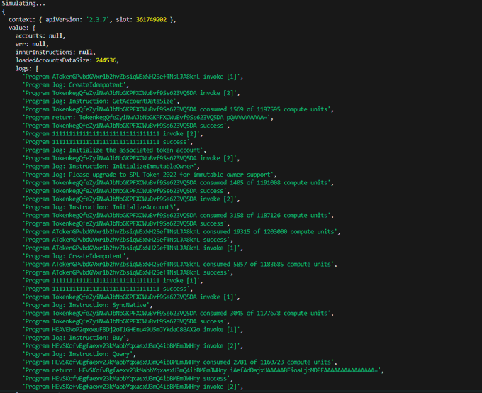

# 🚀 Heaven-Dex-Script

**All-in-One Solana DeFi Automation Toolkit**  
Automate token operations and trading with Bundler, Volume, Copytrading, and Sniper bots for **maximum profit and convenience**.

**License:** MIT  
**Tech Stack:** TypeScript | Node.js | Solana | Jito Bundler | IDL Integration

---

## 🔑 Overview

Heaven-Dex-Script is a **high-performance automation framework** for Solana DeFi, designed for traders and developers who want to:

- Instantly create, buy, and sell tokens using **IDL** (Interface Definition Language).  
- Automate trading strategies via **Bundler, Volume, Copytrading, and Sniper bots**.  
- Optimize profits and workflow with batch operations, MEV protection, and low-latency execution.  
- Monitor trades, wallet balances, and bundle execution in real-time.

This toolkit combines **flexibility, speed, and profitability** in a single, developer-friendly framework.

---

## ✨ Core Features

### Token Operations
- **Create Tokens:** Launch tokens on PumpSwap or compatible Solana DEX platforms.  
- **Buy/Sell via IDL:** Automate token transactions with configurable amounts and batch operations.  
- **Liquidity Management:** Add, remove, or migrate LP tokens efficiently.

### Advanced Bots
- **Bundler Bot:** Atomic multi-transaction execution using Jito relayer.  
- **Volume Bot:** Increase trading volume across wallets for token exposure.  
- **Copytrading Bot:** Follow other wallet strategies automatically.  
- **Sniper Bot:** Target and purchase tokens immediately after launch for maximum opportunity.

### Profit & Efficiency
- Smart slippage and fee optimization.  
- MEV protection to prevent front-running attacks.  
- Lookup tables and batch operations for reduced compute unit usage.  

### Developer-Friendly
- TypeScript-first SDK with full API coverage.  
- CLI tools for trading, monitoring, and automation.  
- Configurable environment for mainnet or devnet usage.

---

## Example

---

## 📬 Contact  

- **Telegram** → [@Kei Novak](https://t.me/Kei4650)
- **X (Twitter)** → [@Kei Novak](https://x.com/kei_4650)  

---